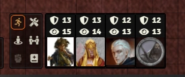
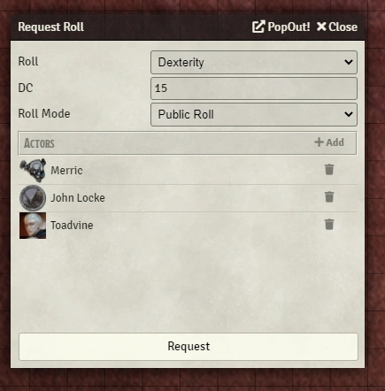
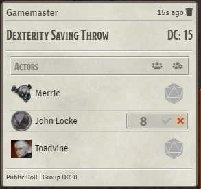
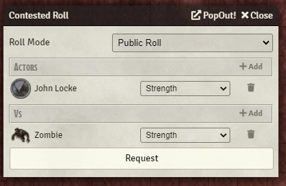
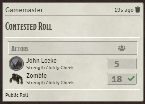
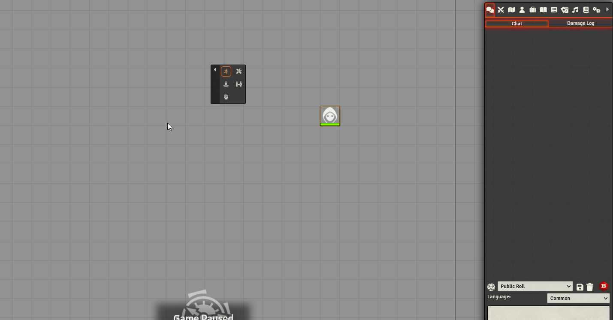
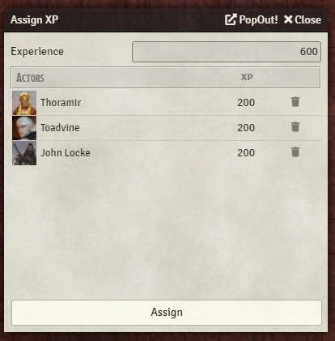
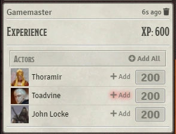
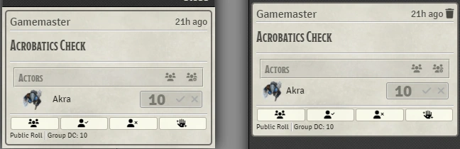

# Monk's TokenBar

Add-On Module for Foundry VTT

Add a token bar to show the current player tokens that are available on the current scene

## Installation
Simply use the install module screen within the FoundryVTT setup

## Usage & Current Features



The player tokens currently in the scene are automatically added.  Tokens need to be owned by a player and of friendly disposition to be automatically included in this list.  If you'd like a token to be included or excluded, there is a dropdown menu added to the Token configuration screen that will allow you to manually change this.  Clicking on the token iteself will center the screen on that token.  Occasionaly I find that I lose track of where the players token is and this is an easy way to get to it quickly.

Right click on the token in the TokenBar to open a context menu with options to edit both the character and token, aswell as targeting that token.  You can also set individual movement restrictions for that specific token.

<ins>**If you are having troubles seeing a token on the token bar, please check to make sure the token is set to friendly disposition and is owned by a player**</ins>

### Limit Movement
You can the limit the movement of tokens.  There are three options available, either free movement where tokens can be moved at will, no movement where tokens aren't allowed to be moved, or combat movement, where only the token whose turn is current can move.  You can set the movement individually for each token via the right-click menu.  Doing so is handy if you trust a player to clean up their movement after their turn is done while you move on to the next player.

### Saving Throw Dialog



Clicking on the saving throw button will open a dialog to facilitate a group saving throw.
Select tokens you wish included and click the button to open the dialog.  Select what type of roll to make.  Optionally enter in a DC to beat, this will only show to the GM but will automatically determine if the roll passed or not.  Clicking the Add button will add any selected tokens not already on the list.

Clicking request will add a chat message and prompt players to roll the saving throw requested.  Results will be show depending on the Roll Mode.

### Contested Roll Dialog



Clicking on the contested roll button will open a dialog to facilitate a contested roll.
If a token is selected and another is set as a target it will automatically fill the two slots.  Otherwise the next token clicked will fill the next avaialble slot.  Individually select what roll each token will make.  
Clicking request will add a chat message and prompt players to roll the contested roll requested.  After both partied have rolled it will show which one won the contested roll.

#### Multiple Choice Requests



You can hold the ```CTRL``` key and click multiple skills to request a choice from among them.

Guide to Roll Mode:

Public Roll will show everyone who's involved and their roll.  
Private GM Roll will show the player everyone else involved but will only reveal their own roll/success.  
Blind Roll will only show the player that they're involved and will not show the result of the roll.  
Self Roll won't show the players at all.  The GM will have to roll the dice themselves.

### Assign XP Dialog



Clicking on the assign XP button will open a dialog to facilitate assigning XP.
Automatically fill with the current player characters associated with the current scene.  Add experience at the top and it will divide between the players evenly.
Additionally once an encounter has finished, the dialog will automatically popup with the calculated XP for the encounter, divided evenly between the participants of the encounter.

### Lootables

New to 1.0.15 added support for converting npc's to lootable if you have the <a href="https://foundryvtt.com/packages/lootsheetnpc5e/">Lootsheet module</a> installed.  TokenBar will remove all feats of the character that should not be lootable and will save them so that the character can be reverted back from lootable.

### Grab the dice roll

It's a bit of a beta feature and only availabe for DnD5e, but if the player rolls their dice outside of the request.  Like clicking on the character sheet to make the roll.  You can grab the roll and add it to the request by clicking the grab roll button in the bottomright corner, then clicking the roll that the character made.

### Roll Card Popout
Roll request chat cards can now be right-clicked and popped out into a seperate window for easier tracking.


## Bug Reporting
I'm sure there are lots of issues with it.
Please feel free to contact me on discord if you have any questions or concerns. ironmonk88#4075

## Support

If you feel like being generous, stop by my <a href="https://www.patreon.com/ironmonk">patreon</a>.

Or [](https://ko-fi.com/R6R7BH5MT)

Not necessary but definitely appreciated.

## License
This Foundry VTT module, writen by Ironmonk, is licensed under [GNU GPLv3.0](https://www.gnu.org/licenses/gpl-3.0.en.html), supplemented by [Commons Clause](https://commonsclause.com/).

This work is licensed under Foundry Virtual Tabletop <a href="https://foundryvtt.com/article/license/">EULA - Limited License Agreement for module development from May 29, 2020.</a>
